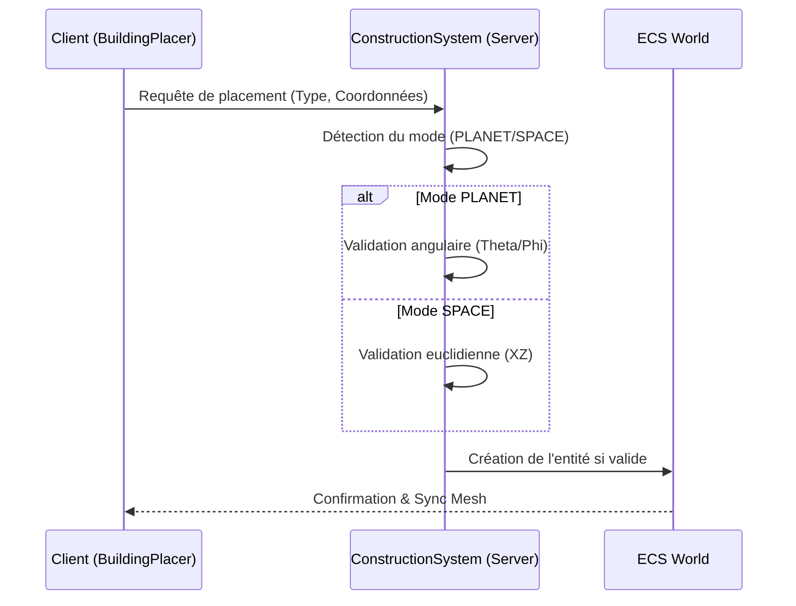
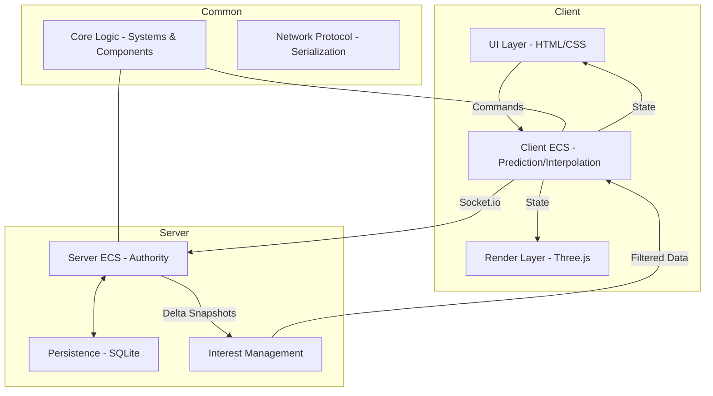

# Architecture Technique - Galactic Dominion

Ce document détaille l'architecture technique du projet, combinant l'implémentation actuelle de l'ECS, la stack technologique et la vision cible.

> **🆕 Mise à jour majeure (24/12/2025) :** Le projet a migré vers une architecture **serveur-authoritative pure**.
> Voir [REFACTORING_NOTES.md](REFACTORING_NOTES.md) pour les détails complets.

## 1. Stack Technologique
- **Moteur de Rendu** : [Three.js](https://threejs.org/) (WebGL)
- **Simulation** : ECS (Entity Component System) personnalisé
- **Backend** : Node.js avec WebSockets (Socket.io)
- **Base de données** : SQLite (Persistance des entités)
- **Architecture** : **Serveur-Authoritative** (Simulation 100% serveur, Client = Rendu + Input)

---

## 2. Architecture ECS (Entity Component System)
L'architecture repose sur trois piliers situés dans [`common/ecs/`](common/ecs/) :
1.  **Entities** : Simples identifiants numériques.
2.  **Components** : Objets de données purs (sans logique) attachés aux entités.
3.  **Systems** : Logique qui s'exécute sur les entités possédant un ensemble spécifique de composants.

### 🧩 Composants ([`common/ecs/components.js`](common/ecs/components.js))
- **Identité & Transformation** : `Identity`, `Position` (avec `referenceFrame`), `Rotation`, `Velocity`.
- **Économie & Production** : `Economy`, `Storage`, `ProductionChain`, `Building`, `ConstructionContext`.
- **Spatial & Flottes** : `Ship`, `Fleet`, `Planet`, `StarSystem`.
- **Combat** : `Combat`, `ShieldWedge`.
- **Logistique** : `Logistics`, `Cargo`, `Sovereignty`.

### ⚙️ Systèmes ([`common/ecs/systems/`](common/ecs/systems/))
| Système | Rôle | Composants requis |
| :--- | :--- | :--- |
| `EconomySystem` | Calcule la production passive de ressources. | `Economy` |
| `ProductionChainSystem` | Gère la transformation des ressources. | `ProductionChain`, `Storage` |
| `FleetSystem` | Gère les déplacements de flottes et les sauts. | `Fleet`, `Position` |
| `CombatSystem` | Résout les tirs et applique les dégâts. | `Combat`, `Position` |
| `LogisticsSystem` | Gère les transferts de ressources. | `Logistics` |
| `ConstructionSystem` | Gère le placement dual (Planète/Espace). | `Building`, `Position`, `ConstructionContext` |

---

## 3. Système de Construction Dual

Le système de construction est conçu pour fonctionner de manière transparente entre les surfaces planétaires et le vide spatial.

### Modes de Fonctionnement
- **Mode PLANET** : Utilisé dans les scènes planétaires. Le placement est contraint à la surface d'une sphère.
- **Mode SPACE** : Utilisé dans les scènes de système. Le placement s'effectue sur un plan orbital (XZ).

### Composants Spécifiques
- **`Position`** : Évolué pour inclure un `referenceFrame` ('global', 'planet_surface', 'orbital'), permettant de situer l'entité par rapport à son parent.
- **`ConstructionContext`** : Stocke les métadonnées de construction, notamment le mode actif, l'ID de l'entité parente (planète/système) et les données de snapping (angles ou coordonnées de grille).

### Flux de Validation


---

## 4. Structure Client / Serveur

### Autorité Serveur
### Autorité Serveur
Le serveur assure l'autorité totale de la simulation. Le client est un terminal de rendu et de saisie.

**⚡ Architecture Actuelle (Post-Refactorisation) :**
- **Serveur** : Exécute **TOUTE** la logique ECS (Economy, Combat, Fleet, etc.), gère la persistance SQLite et diffuse les deltas.
- **Client** : 
  - ✅ Reçoit l'état du serveur (Snapshots/Deltas)
  - ✅ Synchronise les meshes Three.js avec l'ECS (MeshSync)
  - ✅ Capture les inputs utilisateur (BuildingPlacer, etc.)
  - ❌ **N'exécute AUCUNE logique de jeu**

**Structure des Dossiers :**
```
common/ecs/systems/     → Logique métier (exécutée par le serveur)
server/ecs/             → ServerWorld qui charge tous les systèmes
src/render/             → Systèmes de rendu (lecture seule)
src/input/              → Gestionnaires d'input (UI uniquement)
```

### Architecture Multi-Scènes (Three.js)
Le moteur gère trois instances de `THREE.Scene` pour éviter les conflits de profondeur (Z-fighting) :
- **Macro** : Échelle Galactique (Parsecs).
- **Meso** : Échelle Système Solaire (Unités Astronomiques).
- **Micro** : Échelle Planétaire (Kilomètres).

---

## 4. Vision Cible (Architecture Idéale)

### Optimisation ECS (Bitmasks)
Migration vers des **Bitmasks** pour des performances de requêtage en O(1). Chaque composant est associé à un bit (ex: `Position = 1 << 0`).

### Synchronisation Réseau
- **Delta Compression** : Envoi uniquement des champs modifiés.
- **Interest Management (AOI)** : Filtrage des entités envoyées selon la position du joueur (Grid-based).
- **Snapshot Interpolation** : Buffer de 100ms pour lisser les mouvements.


