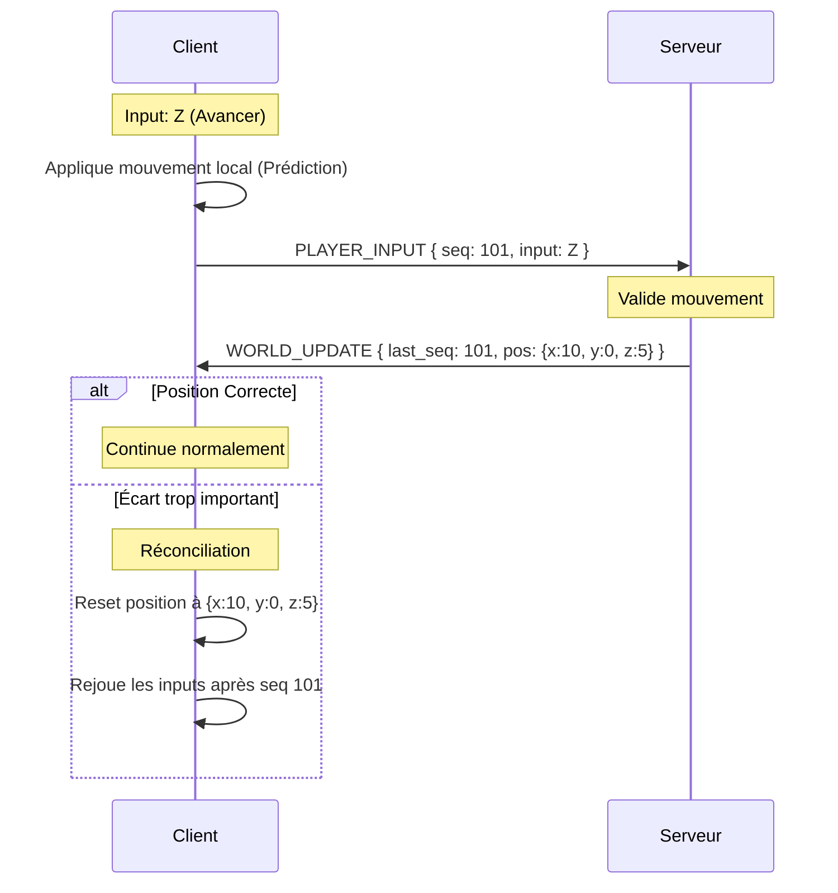

# Architecture Technique : Clone MMO DAoC

Ce document définit l'architecture technique pour un clone de Dark Age of Camelot (DAoC) utilisant TypeScript, Node.js et Three.js/Babylon.js.

## 1. Structure du Projet (Monorepo)

Le projet utilise une structure de monorepo pour faciliter le partage de code entre le client et le serveur.

```text
/workspaces/GameTest/
├── client/                # Application Frontend (Three.js/Babylon.js)
│   ├── src/
│   │   ├── engine/        # Logique de rendu et boucle de jeu client
│   │   ├── network/       # Gestionnaire Socket.io client
│   │   └── ui/            # Interface utilisateur (HUD, Inventaire)
├── server/                # Application Backend (Node.js)
│   ├── src/
│   │   ├── game/          # Boucle de jeu serveur et validation
│   │   ├── network/       # Gestionnaire Socket.io serveur
│   │   └── database/      # Persistance des données (PostgreSQL/MongoDB)
├── shared/                # Code partagé (Isomorphique)
│   ├── src/
│   │   ├── ecs/           # Définitions des composants et systèmes de base
│   │   ├── constants/     # Constantes de jeu (vitesse, portées, etc.)
│   │   └── types/         # Interfaces TypeScript pour le réseau et les données
├── assets/                # Ressources statiques (Modèles 3D, Textures)
└── package.json           # Configuration des Workspaces npm/yarn
```

## 2. Système ECS (Entity Component System)

L'ECS est le cœur de la logique de jeu, partagé entre le client et le serveur pour assurer la cohérence.

### Composants (Data)
- **Position** : `x, y, z, rotationY`
- **Velocity** : `vx, vy, vz` (utilisé pour la prédiction)
- **Stats** : `hp, maxHp, mana, maxMana, stamina, level`
- **Identity** : `name, class, realm (Albion/Hibernia/Midgard)`
- **Inventory** : `items: ItemSlot[]`
- **CombatState** : `targetId, isCasting, lastAttackTimestamp`
- **NetworkSync** : `lastTick, sequenceNumber` (pour la réconciliation)

### Systèmes (Logic)
- **MovementSystem** : Calcule la nouvelle position basée sur la vélocité et les collisions.
- **CombatSystem** : Gère les calculs de dégâts, les résistances et les états (stun, root).
- **AISystem** (Serveur uniquement) : Gère les machines à états des PNJs (Patrouille, Chasse, Retour).
- **SyncSystem** : 
    - Côté Serveur : Diffuse les snapshots aux clients.
    - Côté Client : Applique les snapshots et gère l'interpolation des autres joueurs.

## 3. Protocole Réseau (Socket.io)

La communication est basée sur des événements typés.

| Message | Direction | Description |
| :--- | :--- | :--- |
| `PLAYER_INPUT` | C -> S | Inputs (ZQSD, Jump) + Sequence Number |
| `WORLD_UPDATE` | S -> C | Snapshot des entités visibles (Position, Stats) |
| `COMBAT_ACTION` | C -> S | Utilisation d'une compétence ou attaque |
| `ENTITY_EVENT` | S -> C | Événements ponctuels (Mort, Level up, Loot) |
| `CHAT_MSG` | Bidir | Messages de chat (Canal, Groupe, Royaume) |

## 4. Modèle de Données

### Objets (Items)
```typescript
interface Item {
  id: string;
  templateId: string;
  type: 'WEAPON' | 'ARMOR' | 'CONSUMABLE';
  stats: { strength?: number, quickness?: number, etc. };
  weight: number;
}
```

### Quêtes
```typescript
interface Quest {
  id: string;
  objectives: { type: 'KILL' | 'COLLECT' | 'TALK', targetId: string, count: number }[];
  rewards: { xp: number, gold: number, items: string[] };
}
```

### PNJs
```typescript
interface NPC {
  templateId: string;
  level: number;
  aggroType: 'PASSIVE' | 'AGGRESSIVE' | 'NEUTRAL';
  spawnPoint: { x: number, y: number, z: number };
  lootTable: { itemId: string, chance: number }[];
}
```

## 5. Stratégie de Synchronisation

### Prédiction Client
Le client n'attend pas la réponse du serveur pour se déplacer. Il applique les inputs immédiatement au `MovementSystem` local.

### Réconciliation Serveur
1. Le client envoie chaque input avec un `sequenceNumber`.
2. Le serveur traite l'input, calcule la position officielle et la renvoie avec le `sequenceNumber` correspondant.
3. Si la position serveur diffère trop de la position prédite par le client :
    - Le client remplace sa position par celle du serveur.
    - Le client rejoue tous les inputs locaux qui n'ont pas encore été validés par le serveur pour "rattraper" le retard.

### Interpolation des Entités
Pour les autres joueurs et PNJs, le client ne fait pas de prédiction. Il reçoit des snapshots et interpole les positions entre le dernier snapshot reçu et le précédent pour assurer un mouvement fluide (généralement avec un délai de 100ms).

## 6. Diagramme de Flux Réseau (Réconciliation)


