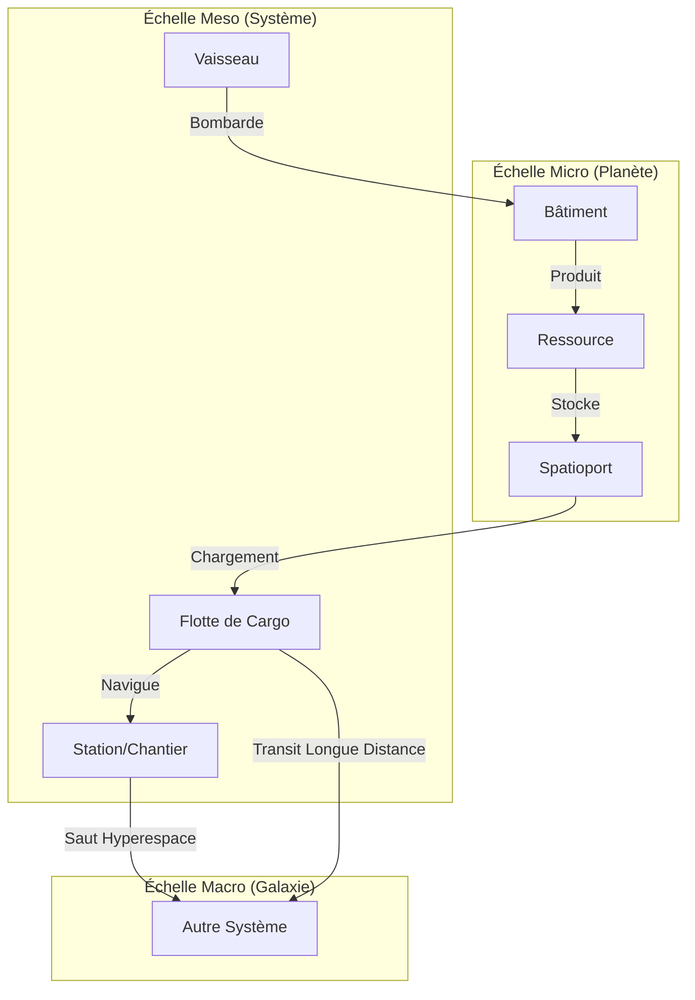

# Game Design - Galactic Dominion

Ce document définit les mécaniques de jeu, l'univers et les systèmes économiques de Galactic Dominion.

## 1. Vision & Concept
**Galactic Dominion** est un MMORTS persistant dans un univers de science-fiction réaliste.
- **Persistance Totale** : L'univers vit 24/7. L'économie et les trajets continuent hors ligne.
- **Échelle Massive** : De la gestion d'un bâtiment planétaire à la stratégie galactique.
- **Logistique Vitale** : Chaque ressource doit être physiquement transportée par des flottes.

---

## 2. L'Univers Multi-échelle
Le gameplay se structure en trois échelles interconnectées :

| Échelle | Référentiel | Unité | Description |
| :--- | :--- | :--- | :--- |
| **Macro** | Centre Galactique | Parsec | Carte stellaire, routes hyper-spatiales, stratégie. |
| **Meso** | Étoile du Système | AU | Navigation interplanétaire, combats de flottes. |
| **Micro** | Centre Planétaire | Kilomètre | City-building, extraction, défense sol-espace. |

---

## 3. Économie et Logistique
L'économie repose sur un flux de ressources réel.

### Ressources de Base
1. **Métal** : Construction de structures et coques de vaisseaux.
2. **Énergie** : Fonctionnement des modules et maintenance des bases.
3. **Crédits** : Monnaie d'échange pour le commerce et les services.

### Chaîne de Production
- **Extraction** : Récupération de ressources brutes sur les planètes ou astéroïdes.
- **Transformation** : Usines convertissant les ressources brutes en composants avancés.
- **Transport Physique** : Les ressources ne sont pas magiquement partagées ; elles doivent être chargées dans des cargos et transportées via le `FleetSystem`.

---

## 4. Système de Combat Tactique
Le combat privilégie la tactique et le positionnement.

### Mécaniques Clés
- **Tab-Target** : Sélection de cible avec validation des tirs par le serveur (portée, angle).
- **Shield Wedge (Bouclier Directionnel)** : Les vaisseaux possèdent des boucliers renforcés sur les flancs. Exposer son nez ou ses moteurs est risqué.
- **Gestion des Flottes** : Les vaisseaux opèrent souvent en formations (V, Cercle, Escorte) pour mutualiser leur puissance de feu et leur défense.

### Interactions Multi-échelles
- **Bombardement Orbital** : Les vaisseaux en vue Meso peuvent attaquer des cibles à la surface (Micro).
- **Défense Sol-Espace** : Les batteries de missiles au sol peuvent intercepter des flottes en orbite.
- **Infiltration** : Déploiement de troupes via des navettes pour capturer des infrastructures ennemies.

---

## 5. Système de Construction

Le jeu propose un système de construction dual s'adaptant à l'échelle de vue actuelle.

### Construction Planétaire (Micro)
Sur les planètes, la construction utilise un **Snapping Sphérique** :
- **Grille Angulaire** : Les bâtiments sont alignés selon des angles `theta` (longitude) et `phi` (latitude) pour assurer une répartition régulière sur la sphère.
- **Orientation Automatique** : Chaque structure est automatiquement orientée perpendiculairement à la surface de la planète (`lookAt` vers le centre).
- **Validation** : La proximité est calculée par distance angulaire pour éviter les chevauchements sur la courbure.

### Construction Spatiale (Meso)
Dans l'espace, le système bascule sur une **Grille Orbitale** :
- **Plan XZ** : Les stations et chantiers navals sont placés sur le plan équatorial du système.
- **Snapping Cartésien** : Utilisation d'une grille fixe (ex: 10 unités) pour faciliter l'alignement des complexes industriels.
- **Validation** : Utilisation de la distance euclidienne standard pour gérer les zones d'exclusion autour des structures.

---

## 6. Schéma de Flux

