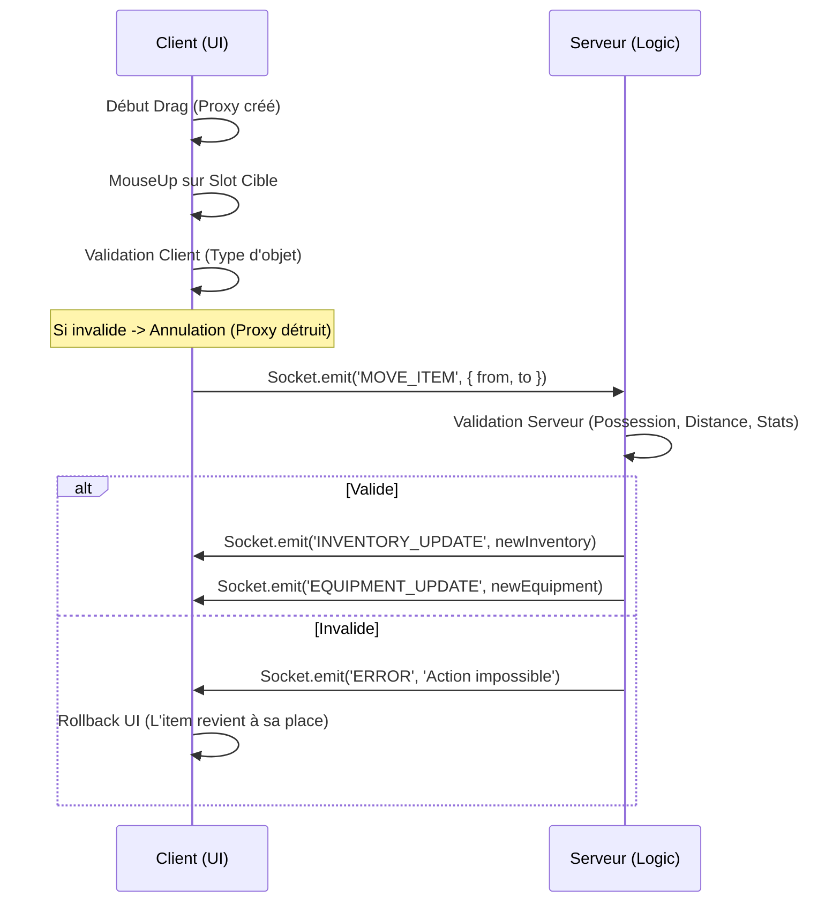

# Spécification Technique : Système de Drag-and-Drop UI

## 1. Architecture de Capture d'Entrées

Le système repose sur un gestionnaire d'entrées centralisé au sein du `UIManager`, utilisant le DOM pour la détection de collision (Raycasting UI).

### Mécanisme de Raycasting
- **Événements écoutés** : `mousedown`, `mousemove`, `mouseup` sur l'objet `window`.
- **Identification des cibles** : Utilisation de `document.elementFromPoint(x, y)` pour identifier si le curseur survole un slot d'inventaire ou d'équipement.
- **Attributs de données** : Les éléments HTML des slots doivent porter des attributs `data` pour faciliter l'identification :
    - `data-slot-type` : "inventory" | "equipment"
    - `data-slot-id` : Index (0-19) ou Nom du slot (MAIN_HAND, etc.)

## 2. Gestion des États de Clic

Le système suit une machine à états simple pour la souris :

| État | Condition | Action |
| :--- | :--- | :--- |
| **IDLE** | Aucune interaction | Curseur par défaut. |
| **HOVER** | Souris sur un slot occupé | Affichage du tooltip (optionnel), highlight du slot. |
| **DRAGGING** | `mousedown` + mouvement > 5px | Création du `DragProxy`, masquage de l'icône d'origine. |
| **DROPPING** | `mouseup` pendant le DRAGGING | Validation de la cible, envoi au serveur, destruction du proxy. |

## 3. Mécanique de Drag-and-Drop

### Le Drag-Proxy
Lorsqu'un drag commence, un élément temporaire est créé :
- **Style** : `position: fixed`, `pointer-events: none`, `z-index: 9999`.
- **Contenu** : Copie de l'icône de l'item avec une opacité de 0.7.
- **Comportement** : Suit les coordonnées `clientX/Y` de la souris.

### Détection et Validation
Le drop est validé selon les règles suivantes :
1. **Type de Slot** : Si la cible est un slot d'équipement, vérifier que `item.slot` correspond au `EquipmentSlot` de la cible.
2. **Capacité** : Si la cible est l'inventaire, vérifier s'il y a de la place (ou si on échange deux items).
3. **Distance** : Si l'item est lâché en dehors de toute zone UI valide, déclencher une action de "Drop au sol" (confirmation requise).

### Flux de Communication (Authoritative)


## 4. Feedback Visuel

Pour assurer une ergonomie digne d'un successeur de DAoC :
- **Highlight Contextuel** : Lorsqu'un item est porté, tous les slots compatibles s'illuminent en vert. Les slots incompatibles peuvent s'assombrir.
- **Aperçu de Stats** : Si l'item est survolé au-dessus d'un slot d'équipement, afficher une comparaison rapide des stats (+/-).
- **Magnétisme** : Le proxy peut avoir un léger effet de "snap" lorsqu'il est proche d'un slot valide.

## 5. Gestion des Fenêtres (Z-Index)

Le `UIManager` gère une pile de fenêtres (`inventoryWindow`, `characterWindow`, etc.) :
- **Focus** : Tout `mousedown` sur une fenêtre la place au sommet de la pile (`z-index` le plus élevé).
- **Priorité** : Le `DragProxy` est toujours au-dessus de toutes les fenêtres.
- **Superposition** : Le raycasting doit ignorer les fenêtres transparentes ou les zones vides pour permettre de cliquer sur le monde derrière si nécessaire.

## 6. Impact sur le Code Existant

### `shared/src/types/Items.ts`
Ajouter une méthode de helper pour la validation :
```typescript
export function canEquip(item: Item, slot: EquipmentSlot): boolean {
    return item.slot === slot;
}
```

### `client/src/ui/UIManager.ts`
- Ajouter des propriétés `isDragging`, `draggedItem`, `dragProxy`.
- Implémenter `handleMouseDown`, `handleMouseMove`, `handleMouseUp`.
- Modifier `updateInventory` pour ajouter les attributs `data-slot-*`.
