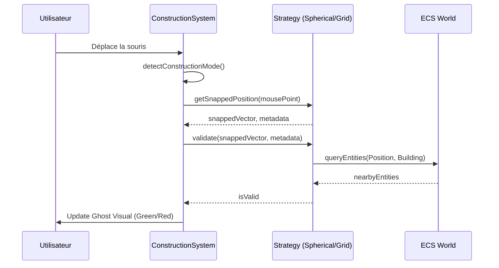

# Architecture du Système de Construction Dual

Ce document détaille la conception du système de construction permettant de bâtir des infrastructures aussi bien sur la surface des planètes que dans l'espace (stations, chantiers navals).

## 1. Modes de Construction

Le système bascule entre deux modes principaux en fonction du contexte de la scène active :

- **PLANET_MODE** : Activé dans `PlanetScene`. La construction est contrainte à la surface d'une sphère.
- **SPACE_MODE** : Activé dans `SystemScene`. La construction se fait sur un plan orbital (généralement XZ) ou par rapport à un point de référence (station existante).

## 2. Stratégies de Snapping

L'interface `ConstructionStrategy` définit la méthode `getSnappedPosition(point, context)`.

### SphericalSnapping (PLANET_MODE)
- **Principe** : Utilise les coordonnées sphériques (Radius, Theta, Phi).
- **Calcul** :
    1. Convertit le point d'impact du raycast en coordonnées sphériques.
    2. Applique un arrondi sur `theta` et `phi` basé sur une `gridSize` angulaire.
    3. Reconvertit en coordonnées cartésiennes pour le positionnement du "ghost".
- **Orientation** : Le bâtiment est orienté via `lookAt(0,0,0)` pour être perpendiculaire à la surface.

### GridSnapping (SPACE_MODE)
- **Principe** : Grille cartésienne classique.
- **Calcul** :
    1. Projette le point sur le plan de construction (ex: Y=0).
    2. Applique un arrondi `Math.round(val / gridSize) * gridSize` sur les axes X et Z.
- **Orientation** : Orientation par défaut (souvent alignée sur la grille) ou rotation manuelle par le joueur.

## 3. Composants ECS

### Modification de `Position`
Ajout d'un champ optionnel pour le référentiel :
```javascript
export const Position = (x = 0, y = 0, z = 0, referenceFrame = 'global') => ({ 
  x, y, z, 
  referenceFrame // 'global', 'planet_surface', 'orbital'
});
```

### Nouveau composant `ConstructionContext`
Utilisé pour stocker les métadonnées de construction d'une entité :
```javascript
export const ConstructionContext = (mode, parentId = null) => ({
  mode, // 'PLANET' | 'SPACE'
  parentId, // ID de la planète ou de la station parente
  snappingData: {} // Stockage des angles theta/phi pour les planètes
});
```

## 4. Interface du ConstructionSystem

Le `ConstructionSystem` devient un orchestrateur :

```javascript
class ConstructionSystem {
  update() {
    const mode = this.detectConstructionMode();
    const strategy = this.getStrategy(mode);
    
    // 1. Raycasting
    // 2. Snapping via strategy.getSnappedPosition()
    // 3. Validation via strategy.validate()
    // 4. Mise à jour du Ghost
  }

  detectConstructionMode() {
    const currentScene = this.game.sceneManager.currentSceneName;
    return currentScene === 'Planet' ? 'PLANET' : 'SPACE';
  }
}
```

## 5. Validation des Collisions

### En Mode Planète
- **Calcul** : Distance angulaire entre deux points sur la sphère.
- **Critère** : `ΔTheta < seuil && ΔPhi < seuil`.

### En Mode Espace
- **Calcul** : Distance Euclidienne (AABB ou sphères de collision).
- **Critère** : `Vector3.distanceTo(other) < minDistance`.

## Diagramme de Séquence


