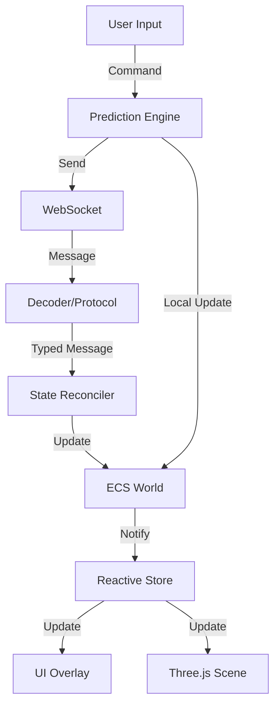

# Stratégie de Migration TypeScript - MMORTS

Ce document détaille la stratégie de migration du projet MMORTS de JavaScript vers TypeScript, visant à améliorer la robustesse, la maintenabilité et la scalabilité du code.

## 1. Structure du Projet (Monorepo)

Nous adopterons une structure Monorepo utilisant les **Workspaces npm/pnpm**. Cela permet de partager facilement les types et la logique métier entre le client et le serveur.

### Architecture des dossiers
```text
/
├── packages/
│   ├── common/           # Code partagé (Types, ECS Core, Constantes)
│   │   ├── src/
│   │   │   ├── ecs/      # Moteur ECS de base
│   │   │   ├── types/    # Interfaces globales et types réseau
│   │   │   └── utils/    # Utilitaires mathématiques et logiques
│   │   └── tsconfig.json
│   ├── server/           # Logique Serveur (Node.js)
│   │   ├── src/
│   │   │   ├── network/  # Gestion des WebSockets
│   │   │   ├── db/       # Persistence (SQLite/EntityCache)
│   │   │   └── systems/  # Systèmes ECS côté serveur
│   │   └── tsconfig.json
│   └── client/           # Logique Client (Vite + Three.js)
│       ├── src/
│       │   ├── render/   # Moteur de rendu Three.js
│       │   ├── ui/       # Interface utilisateur (HTML/CSS/JS)
│       │   └── prediction/ # Réconciliation et prédiction
│       └── tsconfig.json
├── tsconfig.base.json    # Configuration TS partagée
└── package.json          # Configuration des workspaces
```

---

## 2. Interfaces ECS Type-Safe

L'ECS actuel sera migré pour utiliser des types génériques forts.

### Composants de base (Unités, Bâtiments, Grille)

```typescript
// packages/common/src/types/entities.ts

export interface IIdentity {
  name: string;
  ownerId: string | null;
  guildId: string | null;
}

export interface IUnit {
  type: 'fighter' | 'cruiser' | 'transport' | 'construction';
  hull: number;
  maxHull: number;
  shield: number;
  maxShield: number;
  status: 'idle' | 'moving' | 'combat' | 'mining';
}

export interface IBuilding {
  type: 'base' | 'habitation' | 'ferme' | 'usine' | 'entrepot' | 'centrale' | 'mine' | 'labo';
  level: number;
  active: boolean;
  constructionProgress: number; // 0-100
}

export interface IGridCell {
  theta: number;
  phi: number;
  occupiedBy: number | null; // Entity ID
  terrainType: 'plain' | 'mountain' | 'water';
}

export interface IPlanetGrid {
  planetId: number;
  radius: number;
  cellSize: number;
  cells: Map<string, IGridCell>; // Key: "theta,phi"
}
```

### World et Systèmes
```typescript
// packages/common/src/ecs/World.ts

export class World {
  private entities: Set<number>;
  private components: Map<string, Map<number, any>>;
  
  getComponent<T>(entity: number, componentName: string): T | null {
    return this.components.get(componentName)?.get(entity) as T || null;
  }
  
  // ...
}
```

---

## 3. Protocole de Communication Type-Safe

Utilisation de **Discriminated Unions** pour garantir que le traitement des messages est exhaustif et typé.

```typescript
// packages/common/src/types/network.ts

export enum MessageType {
  SNAPSHOT_FULL = 'SF',
  SNAPSHOT_DELTA = 'SD',
  COMMAND_MOVE = 'CM',
  COMMAND_BUILD = 'CB',
  CHAT = 'CH'
}

export interface FullSnapshotMessage {
  type: MessageType.SNAPSHOT_FULL;
  data: any; // Structure complète du monde
  tick: number;
}

export interface DeltaSnapshotMessage {
  type: MessageType.SNAPSHOT_DELTA;
  data: any; // Uniquement les changements
  tick: number;
}

export interface BuildCommand {
  type: MessageType.COMMAND_BUILD;
  buildingType: string;
  position: { theta: number, phi: number };
  planetId: number;
}

export type GameMessage = 
  | FullSnapshotMessage 
  | DeltaSnapshotMessage 
  | BuildCommand;
```

---

## 4. State Manager Centralisé (Basse Latence)

Pour optimiser la latence, nous utiliserons un **State Manager réactif** qui fait le pont entre l'ECS et l'UI/Rendu.

### Architecture du State Manager
- **Source of Truth** : Le `World` ECS.
- **Reactive Layer** : Un store (ex: `Zustand` ou un simple `EventEmitter`) qui notifie les changements sur des entités spécifiques.
- **Optimistic Updates** : Le client applique les commandes localement immédiatement, puis réconcilie avec le serveur.



---

## 5. Étapes de Migration

1. **Phase 1 : Infrastructure**
   - Initialiser le Monorepo.
   - Configurer `tsconfig.json` et les scripts de build.
   - Migrer `common/utils` et les constantes.

2. **Phase 2 : Core ECS**
   - Migrer `common/ecs/World.js` vers TypeScript.
   - Définir toutes les interfaces de composants.
   - Migrer les systèmes de base (Economy, Movement).

3. **Phase 3 : Réseau & Protocole**
   - Migrer `server/network/Protocol.js`.
   - Implémenter les types de messages partagés.
   - Ajouter la validation de schéma (ex: avec `Zod` ou `TypeBox`).

4. **Phase 4 : Client & Serveur**
   - Migration progressive des fichiers `.js` vers `.ts`.
   - Typage des scènes Three.js et du système de grille.
   - Implémentation du State Manager centralisé.
