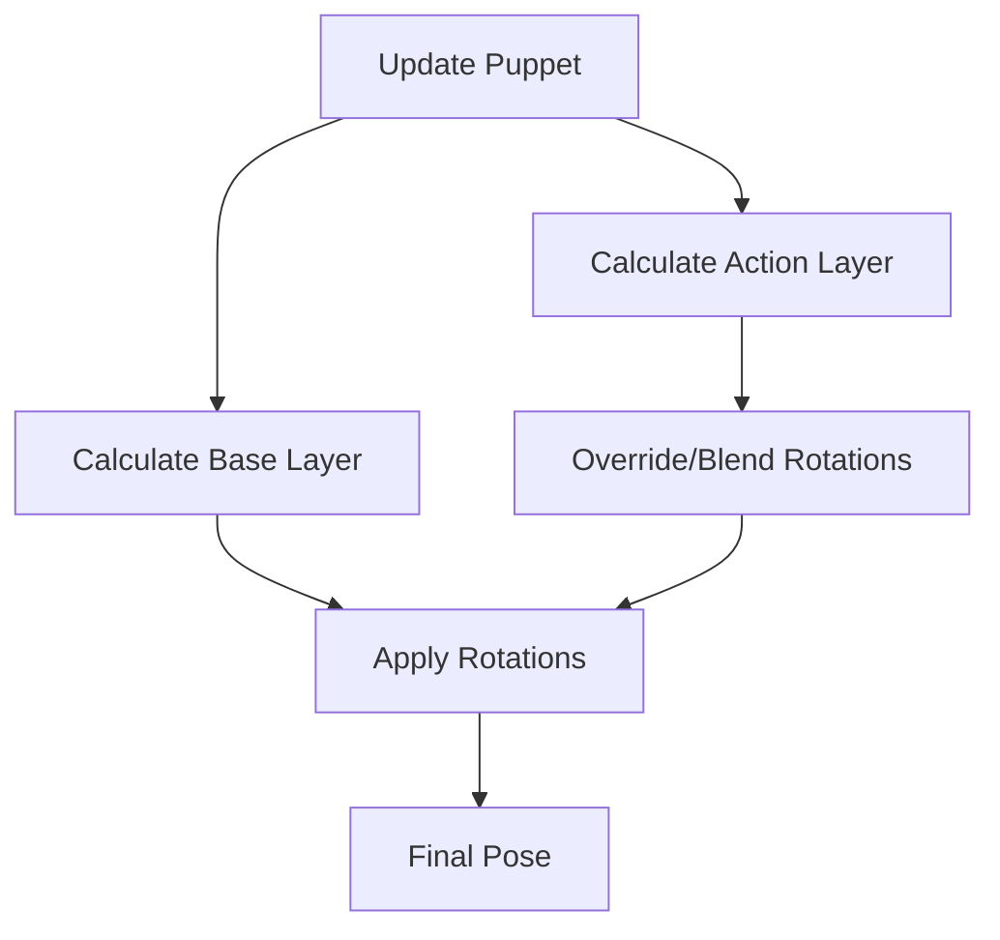
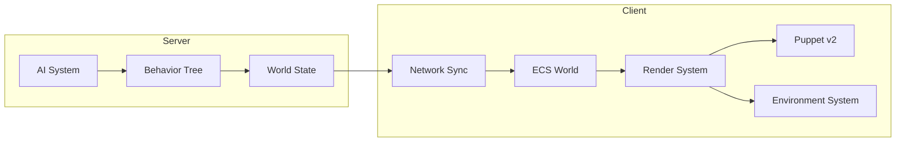

# Architecture MMORPG Arthurien - Spécifications Techniques

Ce document définit l'architecture des systèmes clés pour le MMORPG arthurien, en s'appuyant sur le système "Puppet" existant et l'architecture ECS.

## 1. Système de Personnage Modulaire (Puppet v2)

Le Puppet v2 évolue d'une structure rigide vers une structure modulaire permettant le skinning dynamique et des animations complexes.

### 1.1 Hiérarchie Modulaire et Skinning
Chaque partie du corps est un conteneur (`THREE.Group`) pouvant recevoir un mesh interchangeable.

**Slots de Skinning :**
- `HEAD` : Tête, casques, couronnes.
- `TORSO` : Plastrons, tuniques.
- `ARMS_UPPER/LOWER` : Épaulières, gantelets.
- `LEGS_UPPER/LOWER` : Jambières, bottes.
- `BACK` : Capes, carquois, boucliers rangés.

**Sockets d'Attachement :**
Points pivots spécifiques pour les items tenus :
- `Socket_MainHand` (attaché à `RightHand`)
- `Socket_OffHand` (attaché à `LeftHand`)

### 1.2 Système d'Animation par Couches (Layered Animation)
Le Puppet gère deux couches d'animation mixées par un poids (weight).

- **Base Layer (Locomotion)** : Gère `IDLE`, `WALK`, `RUN`. Affecte l'ensemble du corps.
- **Action Layer (Combat/Interaction)** : Gère `ATTACK`, `BLOCK`, `CAST`, `HIT`. Affecte prioritairement le haut du corps (Torse, Bras, Tête).



---

## 2. Moteur d'Itemisation

L'itemisation suit une structure de données stricte permettant la progression par paliers (tiers).

### 2.1 Structure des Données
```typescript
interface ArthurianItem {
    id: string;
    type: 'WEAPON' | 'ARMOR' | 'CONSUMABLE';
    tier: 1 | 2 | 3 | 4 | 5; // 1: Bois/Cuir, 2: Fer, 3: Acier, 4: Argent, 5: Mythique
    slot: EquipmentSlot;
    visuals: {
        meshType: string; // ex: 'CLAYMORE', 'LONG_BOW'
        colorOverride?: number;
    };
    stats: ItemStats;
}
```

### 2.2 Logique d'Attachement Visuel
Le `EquipmentSystem` (Client) est responsable de la synchronisation entre le composant ECS `Equipment` et l'instance `Puppet`.
- **Armes Arthuriennes** :
    - *Claymore* : Attachée à `Socket_MainHand`, utilise des animations d'attaque lourde.
    - *Arc Long* : Nécessite les deux mains (Action Layer spécifique).
    - *Bâton Druidique* : Émet des particules lors des incantations.

---

## 3. Système d'Environnement (Three.js)

L'ambiance visuelle repose sur le rendu atmosphérique et la génération procédurale.

### 3.1 Atmosphère et Rendu
- **Brouillard Volumétrique** : Utilisation de `THREE.FogExp2` avec une densité variable selon les zones (ex: 0.02 pour les landes, 0.05 pour les marais).
- **Éclairage** : `DirectionalLight` (Soleil/Lune) avec ombres portées + `HemisphereLight` pour simuler la lumière ambiante des landes.
- **Post-processing** : Bloom léger pour les effets magiques et les mégalithes incandescents.

### 3.2 Terrain et Mégalithes
- **Terrain** : Système de chunks (32x32) générés via Simplex Noise pour créer des collines douces et des vallées brumeuses.
- **Mégalithes** : Objets statiques placés via un algorithme de Poisson Disk Sampling pour assurer une distribution naturelle. Utilisation de `InstancedMesh` pour les rochers et mégalithes répétitifs.

---

## 4. Bestiaire et IA

L'IA est pilotée par des arbres de comportement (Behavior Trees) exécutés côté serveur.

### 4.1 Architecture Behavior Tree
Chaque entité possède un BT défini par un JSON ou une structure de classes.

**Noeuds principaux :**
- `Selector` : Choisit entre Combat, Poursuite ou Patrouille.
- `Sequence (Combat)` : Vérifie la portée -> Lance une capacité -> Attend le cooldown.
- `Condition (Aggro)` : Vérifie la distance avec les joueurs et la liste de menace (Threat List).

### 4.2 Définition des Entités
- **Spriggan** : Esprit de la forêt. IA agressive, utilise des attaques de zone (racines sortant du sol).
- **Chevalier Spectral** : Gardien de mégalithe. IA défensive, utilise le blocage et des contre-attaques.
- **Drake des Landes** : Prédateur aérien. IA de harcèlement, reste à distance et plonge pour attaquer.

---

## 5. Intégration ECS et Performance

### 5.1 Stratégie de Composants
- `PuppetComponent` (Client) : Référence à l'instance `Puppet` et gestion de l'état d'animation local.
- `AIComponent` (Server) : Stocke le Blackboard et l'état actuel du Behavior Tree.
- `EnvironmentComponent` (Shared) : Définit les propriétés de la zone (type de brouillard, densité de végétation).

### 5.2 Optimisations Grande Échelle
- **Culling** : Désactivation des mises à jour d'animation pour les Puppets hors du frustum de la caméra ou trop éloignés.
- **Throttling** : Les BT des IA éloignées des joueurs sont mis à jour moins fréquemment (ex: tous les 500ms au lieu de 100ms).
- **Data Oriented** : Utilisation de TypedArrays pour les positions et vélocités afin de minimiser le Garbage Collection lors des rencontres massives.

---

## 6. Diagramme de Flux Global


