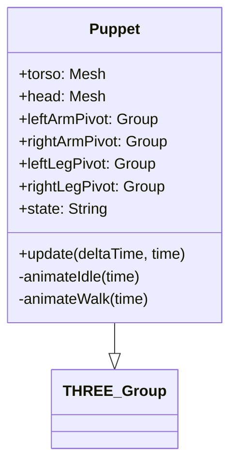

# Plan de Conception : Système de Personnage Modulaire "Puppet"

## 1. Architecture de la Classe `Puppet`

La classe `Puppet` héritera de `THREE.Group` pour faciliter son intégration dans la scène. Elle utilisera une hiérarchie de `THREE.Group` pour les articulations (pivots) et des `THREE.Mesh` pour les parties du corps.

### Hiérarchie des Objets
- **Root (Group)** : Point d'ancrage au sol.
    - **Torso (Mesh - Box)** : Parent principal du corps.
        - **Head (Mesh - Sphere)** : Attachée au haut du torse.
        - **Left Shoulder (Group)** : Pivot pour le bras gauche.
            - **Left Arm (Mesh - Cylinder)**
        - **Right Shoulder (Group)** : Pivot pour le bras droit.
            - **Right Arm (Mesh - Cylinder)**
        - **Left Hip (Group)** : Pivot pour la jambe gauche.
            - **Left Leg (Mesh - Cylinder)**
        - **Right Hip (Group)** : Pivot pour la jambe droite.
            - **Right Leg (Mesh - Cylinder)**

## 2. Système d'Animation

Un automate à états simples (`Idle`, `Walk`) contrôlera les rotations des pivots.

### Logique de mouvement (Sine Waves)
- **Idle** : Légère oscillation verticale du torse et respiration (mouvement subtil des bras).
- **Walk** : 
    - Jambes : Oscillation opposée sur l'axe X (rotation).
    - Bras : Oscillation opposée aux jambes correspondantes.
    - Torse : Légère oscillation verticale (bobbing) et rotation sur l'axe Y.

## 3. Diagramme de Classe (Mermaid)

## 4. Implémentation Technique
Le fichier sera créé dans `client/src/puppet_system.ts` (ou un nom similaire) pour être compatible avec l'environnement Vite/Three.js existant.

### Spécifications des Primitives
- **Torso** : BoxGeometry(1, 1.5, 0.5)
- **Head** : SphereGeometry(0.3)
- **Limbs** : CylinderGeometry(0.15, 0.15, 1)
