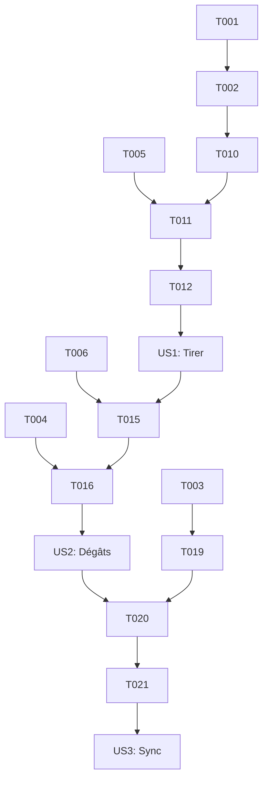

# Tasks: Feature 006: Basic Combat (Lasers)

**Input**: Documents de conception de `specs/006-basic-combat-lasers/`
**Prerequisites**: plan.md, spec.md, research.md, data-model.md, contracts/

**Tests**: Les tests unitaires sont inclus pour valider la logique de combat et de collision.

**Organization**: Les tâches sont regroupées par scénario utilisateur pour permettre une implémentation et des tests indépendants.

## Format: `[ID] [P?] [Story] Description`

- **[P]**: Peut être exécuté en parallèle (fichiers différents, pas de dépendances)
- **[Story]**: À quel scénario utilisateur cette tâche appartient (ex: US1, US2, US3)
- Les chemins de fichiers exacts sont inclus dans les descriptions

## Phase 1: Setup (Infrastructure Partagée)

**Purpose**: Initialisation de la structure et des types de base.

- [x] T001 Créer la structure des dossiers pour le combat dans `src/core/combat/`
- [x] T002 [P] Définir les types de base pour les projectiles et le combat dans `src/core/combat/types.ts`
- [x] T003 [P] Définir les types de messages P2P dans `src/core/network/contracts.ts` (basé sur `specs/006-basic-combat-lasers/contracts/combat-messages.md`)

---

## Phase 2: Foundational (Prérequis Bloquants)

**Purpose**: Infrastructure ECS et système de collision de base.

- [x] T004 Créer le `HealthComponent` dans `src/ecs/components/HealthComponent.ts`
- [x] T005 Créer le `WeaponComponent` dans `src/ecs/components/WeaponComponent.ts`
- [x] T006 Implémenter la logique de Raycasting de base dans `src/core/physics/CollisionSystem.ts`
- [x] T007 [P] Créer les tests unitaires pour le système de collision dans `tests/unit/core/physics/CollisionSystem.test.ts`

**Checkpoint**: Fondations prêtes - l'implémentation des scénarios utilisateurs peut commencer.

---

## Phase 3: User Story 1 - Tirer des lasers (Priority: P1) 🎯 MVP

**Goal**: Permettre au joueur de tirer des projectiles qui se déplacent.

**Independent Test**: Appuyer sur le bouton gauche de la souris ou Ctrl et voir un laser apparaître et avancer.

### Tests pour User Story 1

- [x] T008 [P] [US1] Créer les tests unitaires pour le `ProjectileManager` dans `tests/unit/core/combat/ProjectileManager.test.ts`
- [x] T009 [P] [US1] Créer les tests unitaires pour le `ProjectileSystem` dans `tests/unit/ecs/systems/ProjectileSystem.test.ts`

### Implementation pour User Story 1

- [x] T010 [US1] Implémenter le `ProjectileManager` pour gérer le rendu Three.js des lasers dans `src/core/combat/ProjectileManager.ts`
- [x] T011 [US1] Implémenter le `ProjectileSystem` pour mettre à jour la position des lasers dans `src/ecs/systems/ProjectileSystem.ts`
- [x] T012 [US1] Ajouter la gestion des entrées (Souris/Ctrl) dans `src/ui/input/MovementController.ts` pour déclencher le tir
- [x] T013 [US1] Intégrer le `WeaponComponent` dans la création du vaisseau joueur

**Checkpoint**: Le joueur peut tirer des lasers visibles qui se déplacent.

---

## Phase 4: User Story 2 - Infliger des dégâts (Priority: P1)

**Goal**: Détecter les impacts et réduire les points de vie des cibles.

**Independent Test**: Tirer sur un vaisseau cible et vérifier que ses HP diminuent et qu'il disparaît à 0 HP.

### Tests pour User Story 2

- [x] T014 [P] [US2] Créer les tests unitaires pour le `CombatSystem` dans `tests/unit/ecs/systems/CombatSystem.test.ts`

### Implementation pour User Story 2

- [x] T015 [US2] Implémenter le `CombatManager` pour orchestrer les impacts dans `src/core/combat/CombatManager.ts`
- [x] T016 [US2] Implémenter le `CombatSystem` pour gérer la logique de dégâts et de destruction dans `src/ecs/systems/CombatSystem.ts`
- [x] T017 [US2] Créer un composant UI `HealthBar` simple dans `src/ui/components/HealthBar.ts` pour visualiser les HP
- [x] T018 [US2] Ajouter la suppression des lasers lors de l'impact ou en fin de vie dans `src/core/combat/ProjectileManager.ts`

**Checkpoint**: Le combat local est fonctionnel avec détection d'impact et gestion des HP.

---

## Phase 5: User Story 3 - Synchronisation des combats (Priority: P1)

**Goal**: Synchroniser les tirs et les impacts entre les joueurs via PeerJS.

**Independent Test**: Ouvrir deux instances de jeu, tirer avec l'une et voir le laser et l'impact sur l'autre.

### Implementation pour User Story 3

- [x] T019 [US3] Étendre `ConnectionManager` pour supporter les messages `FIRE_LASER` et `HIT_TARGET` dans `src/core/network/ConnectionManager.ts`
- [x] T020 [US3] Intégrer l'envoi de messages réseau dans `CombatManager` lors d'un tir ou d'un impact
- [x] T021 [US3] Implémenter la réception des messages réseau pour créer des projectiles distants et appliquer des dégâts distants
- [x] T022 [US3] Ajouter une validation basique côté récepteur pour les messages `HIT_TARGET`

**Checkpoint**: Le combat est entièrement synchronisé en P2P.

---

## Phase 6: Polish & Cross-Cutting Concerns

**Purpose**: Optimisations et gestion des cas limites.

- [ ] T023 [P] Optimiser le rendu des lasers avec `InstancedMesh` si nécessaire dans `src/core/combat/ProjectileManager.ts`
- [ ] T024 Gérer la suppression des projectiles sortant des limites de la zone de jeu
- [ ] T025 [P] Ajouter des logs pour le débogage des combats dans `src/core/combat/CombatManager.ts`
- [ ] T026 S'assurer que les vaisseaux détruits sont correctement nettoyés de la scène et du réseau

---

## Dependency Graph

## Parallel Execution Examples

### Per User Story
- **US1**: T008 et T009 peuvent être faits en parallèle.
- **US2**: T014 peut être fait en parallèle de T015.
- **US3**: T019 peut être préparé pendant que US2 est en cours.

### Cross-Story
- La Phase 1 (Setup) et Phase 2 (Foundational) peuvent être largement parallélisées (T002, T003, T004, T005, T007).
