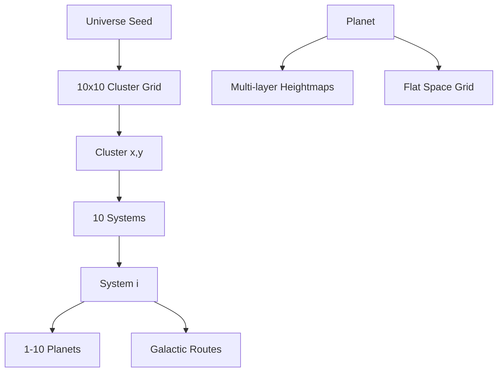

# Data Model: World Generation (Lattice)

## Hierarchy Overview

The universe is a hierarchical structure generated from a single seed.



## Data Structures

### 1. Universe State
```typescript
interface UniverseState {
  seed: string;
  clusters: Map<string, ClusterData>; // key: "x,y"
}
```

### 2. Cluster Data
```typescript
interface ClusterData {
  id: string; // "cluster-x-y"
  coords: { x: number; y: number };
  systems: SystemData[]; // Exactly 10
  centers: string[]; // IDs of 1-2 center systems
  routes: GalacticRoute[]; // Connections to adjacent cluster centers
}
```

### 3. System Data
```typescript
interface SystemData {
  id: string;
  name: string;
  starType: 'YellowDwarf' | 'RedGiant' | 'BlueGiant' | 'NeutronStar';
  position: { x: number; y: number; z: number }; // Relative to cluster center
  planets: PlanetData[];
}
```

### 4. Planet Data
```typescript
interface PlanetData {
  id: string;
  name: string;
  radius: number;
  orbitDistance: number;
  color: number; // Hex color
  heightmapSeed: string;
  resourceDensitySeeds: Map<ResourceType, string>;
  spaceGrid: { radius: number; resolution: number };
}
```

### 5. Galactic Route
```typescript
interface GalacticRoute {
  startSystemId: string;
  endSystemId: string;
  type: 'InterCluster';
}
```

## ECS Components

### `LocationComponent`
Tracks where an entity is in the lattice and its current view scale.
```typescript
interface LocationComponent {
  clusterX: number;
  clusterY: number;
  systemId: string;
  viewScale: 'Galaxy' | 'System' | 'Planet';
  localPos: { x: number; y: number; z: number };
}
```

### `PlanetComponent`
Stores the static data of a planet for the renderer and physics.
```typescript
interface PlanetComponent {
  data: PlanetData;
  heightmapData?: Float32Array; // Generated lazily
}
```

### `ResourceComponent`
Stores the available resources on a planet or in a cargo.
```typescript
interface ResourceComponent {
  amounts: Map<ResourceType, number>;
}
```

## Determinism Strategy

- Use `seedrandom` with the **Alea** algorithm.
- `ClusterSeed = hash(UniverseSeed + clusterX + clusterY)`
- `SystemSeed = hash(ClusterSeed + systemIndex)`
- `PlanetSeed = hash(SystemSeed + planetIndex)`
- `HeightmapSeed = hash(PlanetSeed + "heightmap")`

This ensures that we can generate any part of the universe lazily without generating the whole thing, while maintaining consistency.
