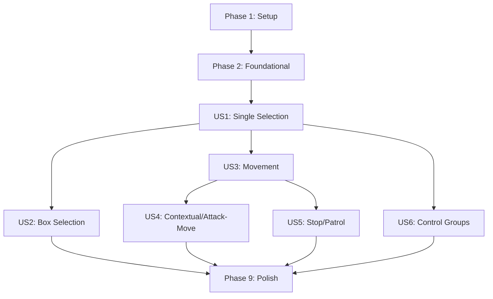

# Tasks: RTS Unit Selection and Command System

**Input**: Design documents from `/specs/010-rts-unit-control/`
**Prerequisites**: plan.md, spec.md, research.md, data-model.md, contracts/

## Format: `[ID] [P?] [Story] Description`

- **[P]**: Can run in parallel (different files, no dependencies)
- **[Story]**: Which user story this task belongs to (e.g., US1, US2, US3)
- Include exact file paths in descriptions

## Phase 1: Setup (Shared Infrastructure)

**Purpose**: Project initialization and basic structure

- [x] T001 [P] Create `SelectableComponent` in `src/ecs/components/SelectableComponent.ts`
- [x] T002 [P] Define `SelectionState` and `RTSCommand` types in `src/core/input/types.ts`
- [x] T003 Initialize `SelectionManager` class in `src/core/input/SelectionManager.ts`

---

## Phase 0: Tests (TDD - Non-négociable)

**Purpose**: Write tests before implementing features, per Constitution Principle VII.

- [ ] T031 [P] Add unit tests for `SelectionManager` in `tests/unit/core/input/SelectionManager.test.ts`
- [ ] T032 [P] Add unit tests for `SelectionSystem` in `tests/unit/ecs/systems/SelectionSystem.test.ts`
- [ ] T033 [P] Add integration test for `CommandDispatcher` in `tests/integration/rts-controls/CommandDispatcher.test.ts`

---

## Phase 2: Foundational (Blocking Prerequisites)

**Purpose**: Core systems needed for all user stories

- [x] T004 [P] Implement 2D Spatial Grid for optimized unit lookups in `src/core/utils/SpatialGrid.ts`
- [x] T005 Implement `SelectionSystem` for rendering selection circles in `src/ecs/systems/SelectionSystem.ts`
- [x] T006 [P] Initialize `CommandDispatcher` for P2P command handling in `src/core/input/CommandDispatcher.ts`

**Checkpoint**: Foundation ready - user story implementation can now begin

---

## Phase 3: User Story 1 - Single Unit Selection (Priority: P1) 🎯 MVP

**Goal**: Click on a single unit to select it and see a visual highlight.

- [x] T007 [US1] Implement single-click raycasting using Spatial Grid in `src/core/input/SelectionManager.ts`
- [ ] T034 [US1] Implement 5px click tolerance to distinguish click from drag in `src/core/input/SelectionManager.ts`
- [x] T008 [US1] Implement selection state update and deselection logic in `src/core/input/SelectionManager.ts`
- [x] T009 [US1] Add visual highlight toggle logic in `src/ecs/systems/SelectionSystem.ts`
- [x] T010 [US1] Implement additive selection (Shift key) for click and box selection in `src/core/input/SelectionManager.ts`

---

## Phase 4: User Story 2 - Box Selection (Priority: P1)

**Goal**: Click and drag to select multiple units.

- [x] T011 [US2] Integrate Three.js `SelectionBox` and `SelectionHelper` in `src/core/input/SelectionManager.ts`
- [x] T012 [US2] Implement box selection filtering for entities with `SelectableComponent` in `src/core/input/SelectionManager.ts`
- [x] T013 [P] [US2] Add CSS styles for the selection box marquee in `src/ui/styles/selection.css`

---

## Phase 5: User Story 3 - Movement Command (Priority: P1)

**Goal**: Right-click on ground to move selected units.

- [x] T014 [US3] Implement right-click ground detection and coordinate projection in `src/core/input/CommandDispatcher.ts`
- [x] T015 [US3] Implement `MOVE` command creation with Ed25519 signing in `src/core/input/CommandDispatcher.ts`
- [x] T016 [US3] Integrate command broadcast with `ConnectionManager` in `src/core/input/CommandDispatcher.ts`
- [ ] T017 [P] [US3] Implement temporary visual feedback (ground indicator) in `src/core/renderer/CommandFeedbackRenderer.ts`

---

## Phase 6: User Story 4 - Contextual Commands & Attack-Move (Priority: P2)

**Goal**: Right-click enemies to attack or resources to harvest; support Attack-Move.

- [x] T018 [US4] Implement contextual target detection (Enemy vs Resource) in `src/core/input/CommandDispatcher.ts`
- [x] T019 [US4] Implement `ATTACK` and `HARVEST` command generation in `src/core/input/CommandDispatcher.ts`
- [ ] T020 [US4] Implement Attack-Move (A + Left Click) input handling in `src/core/input/CommandDispatcher.ts`
- [ ] T021 [US4] Update `CommandType` and `RTSCommand` to support `ATTACK_MOVE` in `src/core/input/types.ts`

---

## Phase 7: User Story 5 - Stop & Patrol (Priority: P2)

**Goal**: Explicitly stop units or set them to patrol between two points.

- [ ] T022 [US5] Implement `STOP` command handling in `src/core/input/CommandDispatcher.ts`
- [ ] T023 [US5] Implement `PATROL` command handling in `src/core/input/CommandDispatcher.ts`
- [ ] T024 [US5] Update `MovementSystem` to handle `PATROL` state (looping) in `src/ecs/systems/MovementSystem.ts`
- [ ] T025 [P] [US5] Add keyboard shortcuts (S, P) in `src/core/input/InputHandler.ts`

---

## Phase 8: User Story 6 - Control Groups (Priority: P2)

**Goal**: Assign and recall unit groups using numeric keys.

- [ ] T026 [US6] Implement control group storage in `src/core/input/SelectionManager.ts`
- [ ] T027 [US6] Implement Ctrl+[0-9] and [0-9] key handling in `src/core/input/InputHandler.ts`

---

## Phase 9: Polish & Optimization

**Purpose**: Performance and final touches.

- [ ] T028 [P] Optimize spatial grid update frequency for 1000+ units in `src/core/utils/SpatialGrid.ts`
- [ ] T029 [P] Implement selection persistence across environment transitions in `src/core/input/SelectionManager.ts`

---

## Phase 10: Verification

**Purpose**: Validate success criteria and performance goals.

- [ ] T035 [SC-001] Profile box selection with 50 units (Goal: <1s)
- [ ] T036 [SC-002] Profile rendering with 1000+ units (Goal: 60 FPS)
- [ ] T037 [SC-003] Measure command latency in local simulation (Goal: <100ms)
- [ ] T038 [SC-004] Verify 100% command reliability on valid targets
- [ ] T030 Final integration testing and performance profiling of the selection frustum

## Dependency Graph

## Implementation Strategy

1. **MVP**: Complete US1 and US3 first to enable basic "Select & Move" gameplay.
2. **Incremental**: Add US2 (Box Selection) for group management.
3. **Advanced**: Implement US4, US5, and US6 to complete the RTS control loop.
